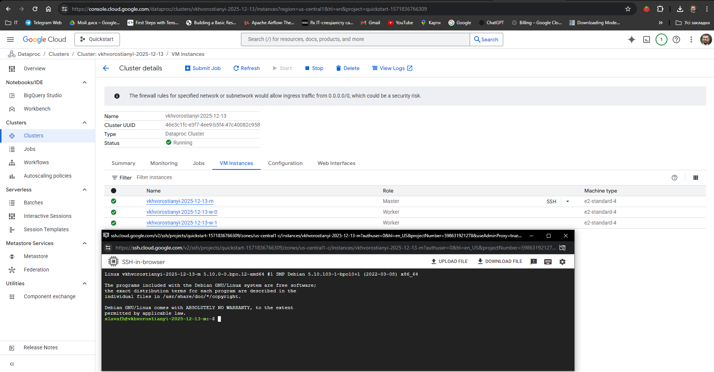
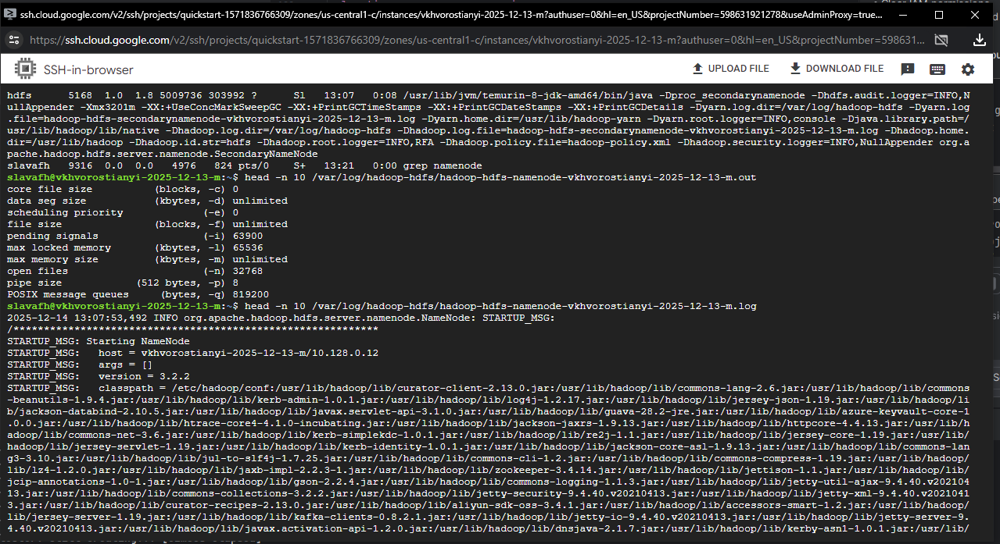
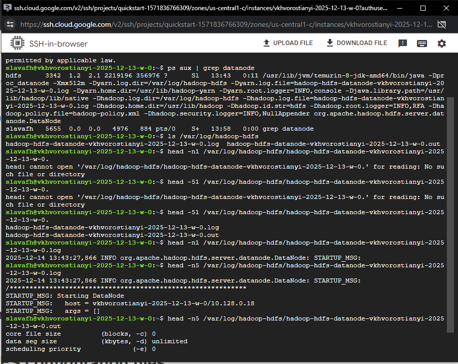
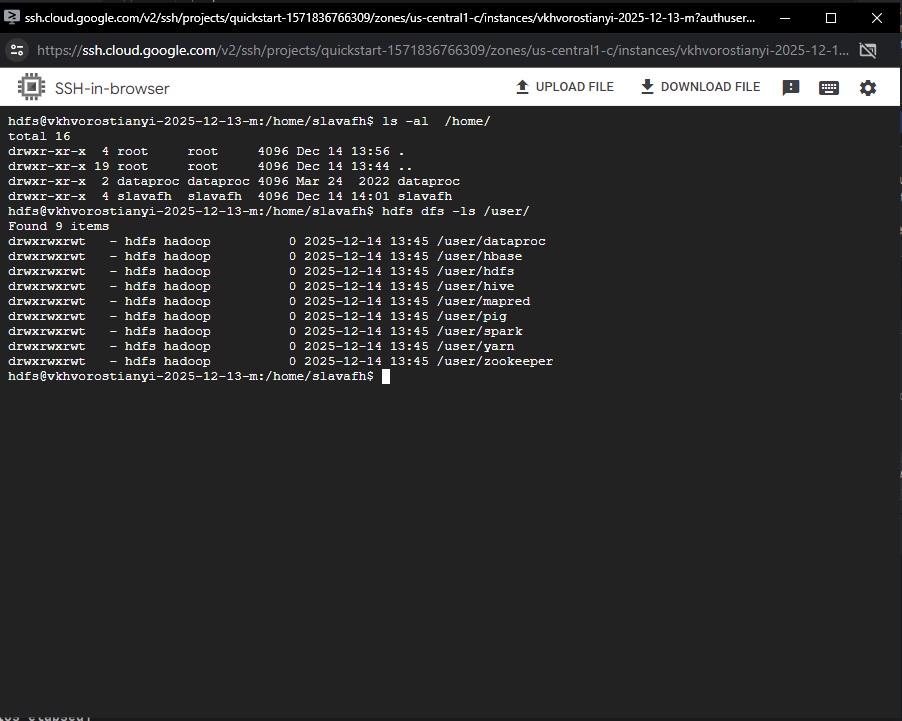
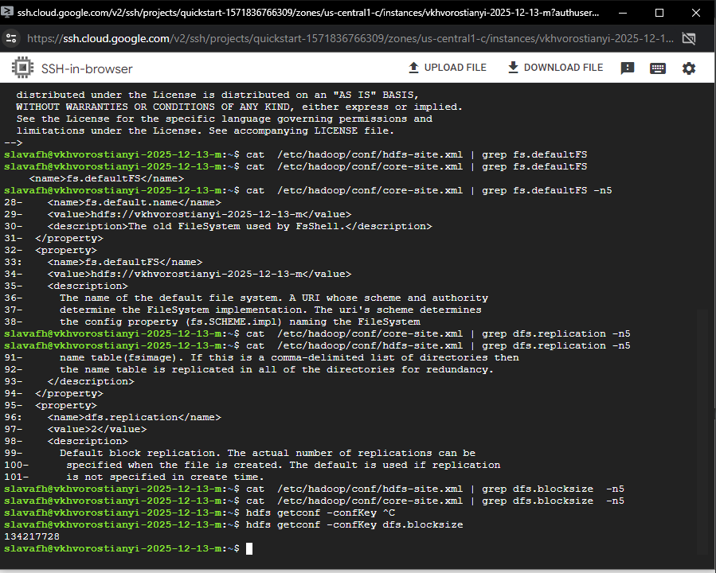
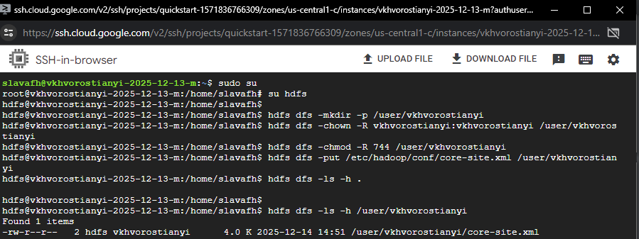
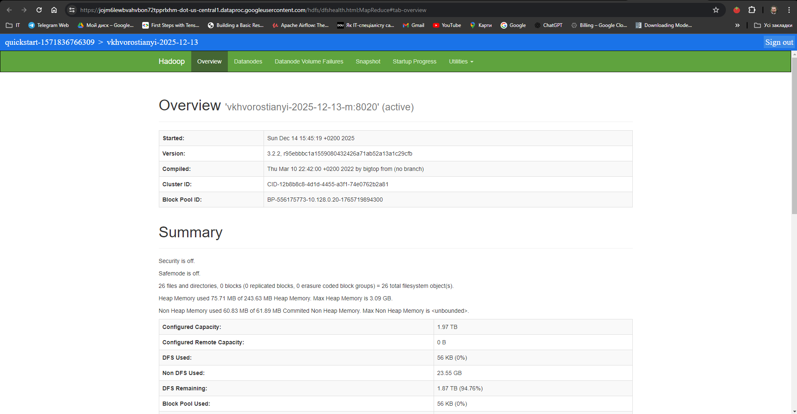
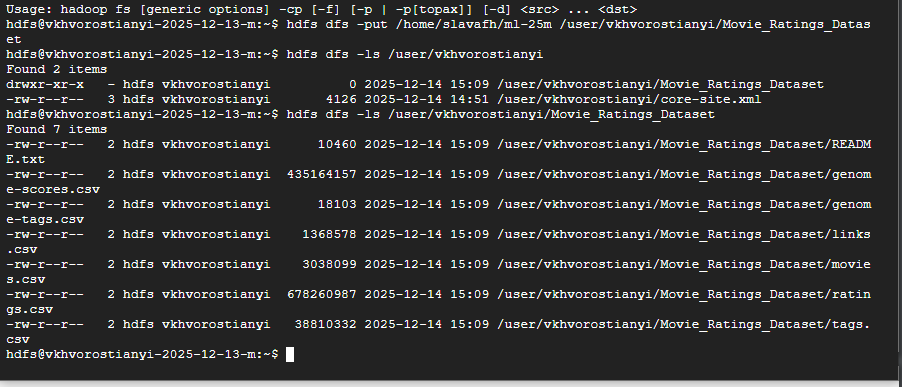
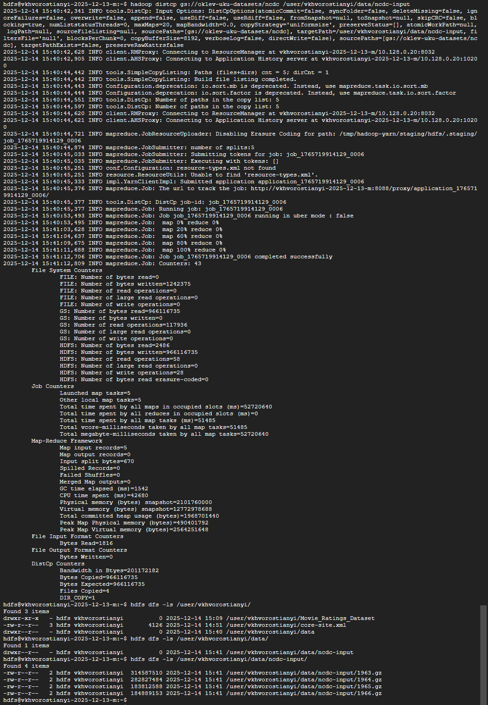
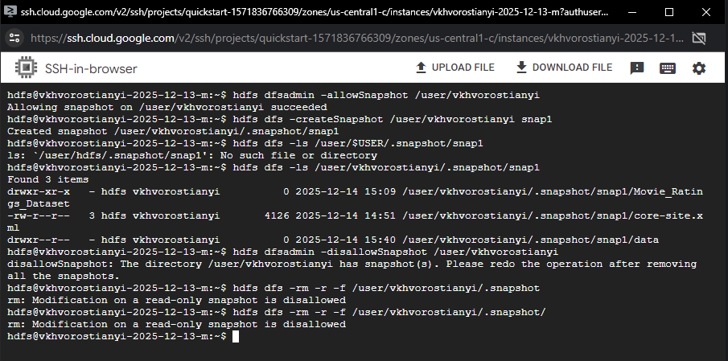

### Homework 1-2:
#### Task 1: 
1. Create Dataproc Cluster using terraform and connect to it via SSH

2. Run Namenode status command and display logs

3. Run Datanode status command and display logs
  
4. Run hdfs commands  

  

5. Hadoop overview

#### Task 2:
1. Copy Movie Ratings dataset to HDFS

#### Task 3:
1. Run MapReduce job to copy data from gs to HDFS

#### Task 4 
1. Create snapshot:

