# HW4: Apache Hive 

---

## Task 1: Create External Tables and Verify Data

**Objective:**
- Create external tables `ratings_text`, `movies_text`, `tags_text` with text storage format
- Run simple `COUNT(*)` queries to verify data loading

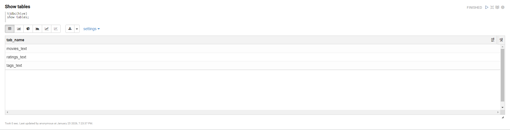

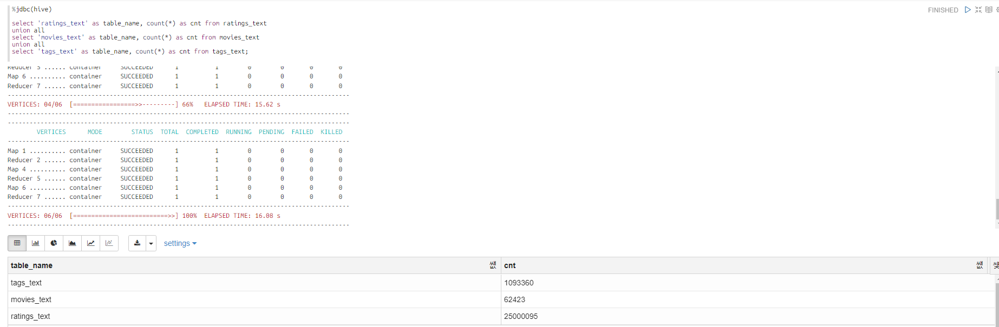

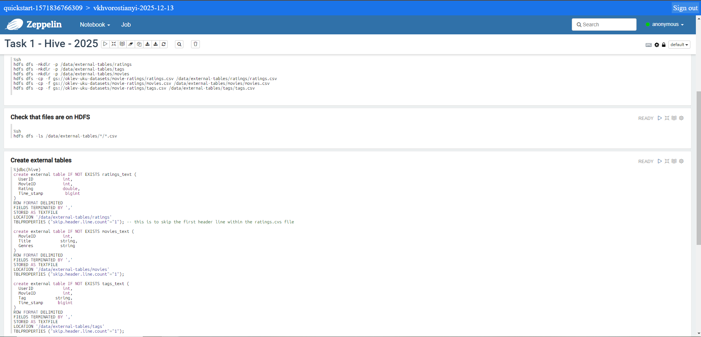

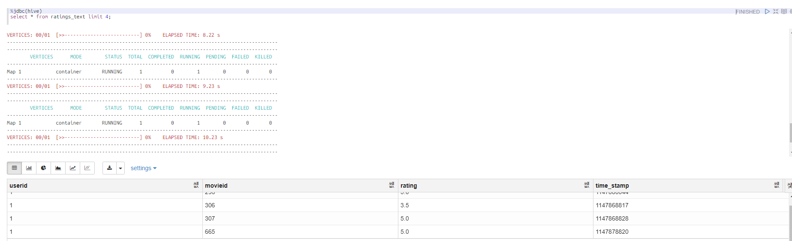

---

## Task 2: Storage Format Comparison

**Objective:**
- Create managed tables with different storage formats: SequenceFile, ORC, Parquet
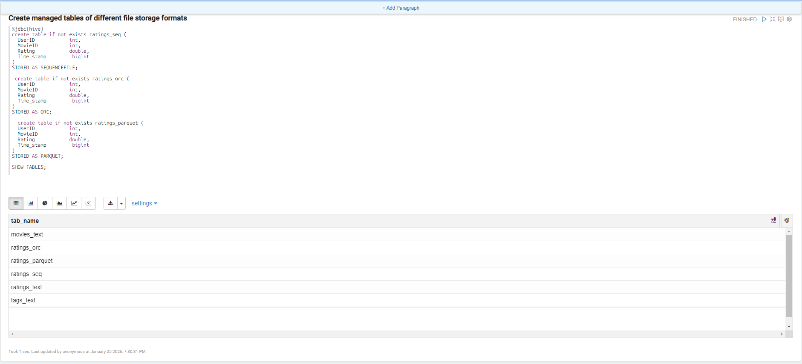

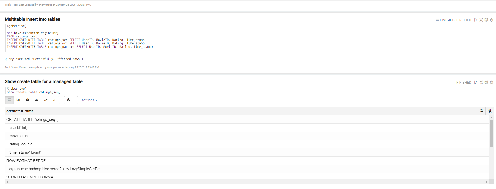

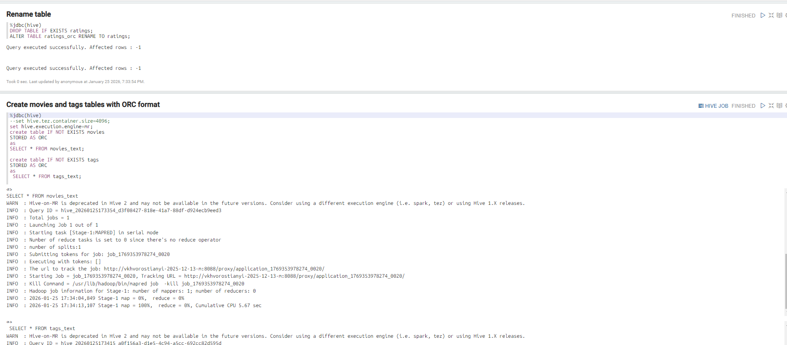

---

## Task 3: Partitioned Table by Year

**Objective:**
- Create `ratings_task3` table partitioned by year
- Load data with dynamic partitioning

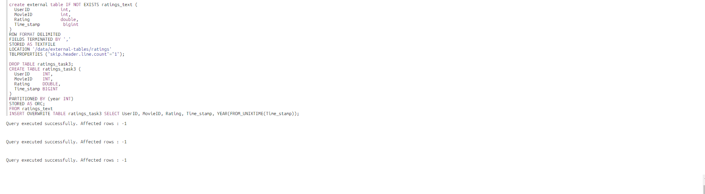

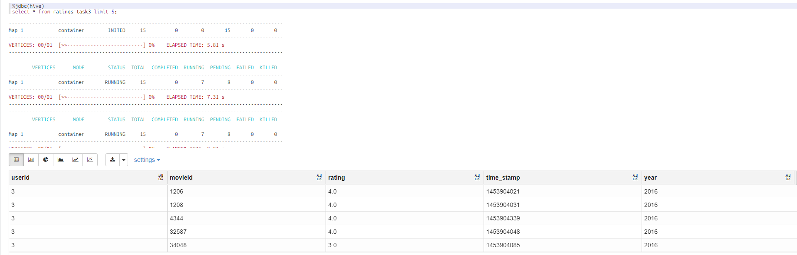

---

## Task 4: Genre Analysis with LATERAL VIEW

**Objective:**
- Count number of movies by genre and sort by descending count
- Output only genres with occurrence > 200
- Use LATERAL VIEW and EXPLODE functions

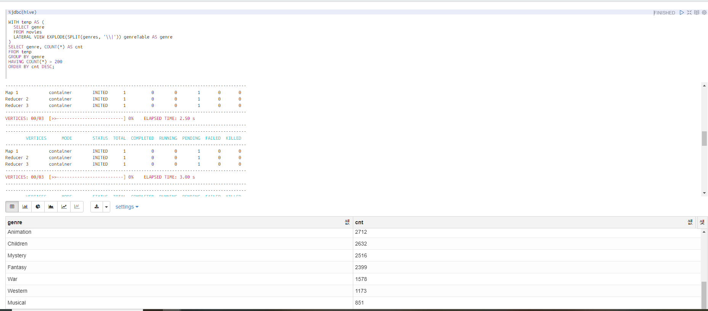

---

## Task 5: Top Movies by Tag Analysis

**Objective:**
- Find top 5 movies with highest average rating for tags "based on a book" and "based on a play"
- Use DENSE_RANK() analytical function partitioned by tag
- Join ratings and tags tables
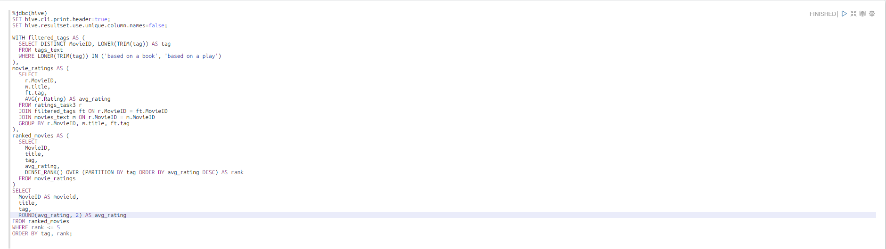

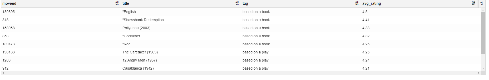
